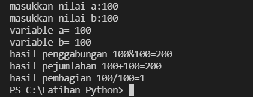
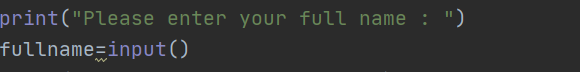
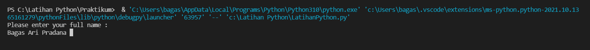
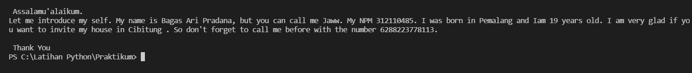
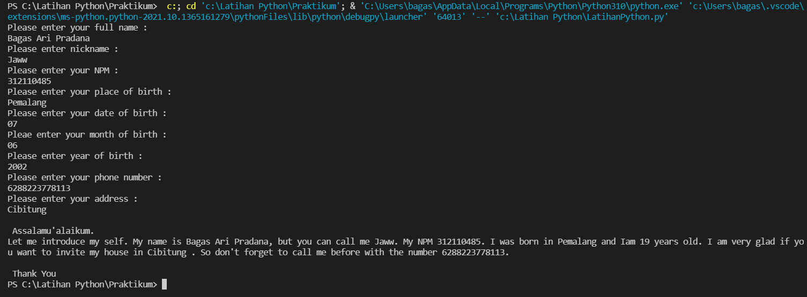

# Latihan-Python

NAMA: Bagas Ari Pradana

KELAS: TI.21.C5

NIM:312110485

# Latihan1

Program Penjumblahan Pembagian Penggabungan

# Code:

    a=int(input("masukkan nilai a:"))
    b=int(input("masukkan nilai b:"))
    print("variable a=",a)
    print("variable b=",b)
    print("hasil penggabungan {1}&{0}=%d".format(a,b) %(a+b))

    #konversi nilai variable
    a=int(a)
    b=int(b)
    print("hasil pejumlahan {1}+{0}=%d".format(a,b) %(a+b))
    print("hasil pembagian {1}/{0}=%d".format(a,b) %(a/b))

# Output 

# code latihan python

    print("Please enter your full name : ")
    fullname=input()
    print("Please enter nickname : ")
    nickname=input()
    print("Please enter your NPM : ")
    npm=int(input())
    print("Please enter your place of birth : ")
    pob=input()
    print("Please enter your date of birth : ")
    date=int(input())
    print("Pleae enter your month of birth : ")
    month=input()
    print("Please enter year of birth : ")
    year=int(input())
    print("Please enter your phone number : ")
    phone=int(input())
    print("Please enter your address : ")
    address=input()

    dob=2021-year

    print("\n Assalamu'alaikum. ")
    print(f"Let me introduce my self. My name is {fullname}, but you can call me {nickname}. My NPM {npm}. I was born in {pob} and Iam {dob} years old. I am very glad if you want to invite my house in {address}. So don't forget to call me before with the number {phone}. \n\n Thank You ")

## Berikut penjelasan :

    print("please your full name : ")

source code fiatas berfungsi untuk mencetak hasil / output berupa " please enter your full name : ".
Untuk menampilkan output string, saya menggunakan tanda petik dua didalam fungsi print(), sedangkan jika saya ingin menampilkan output / hasil berupa angka / interger saya tidak perlu menggunakan tanda petik dua. Contohnya:

    print("nama saya adalah ...")
    print(1801)

(Seperti gambar berikut ini) 

### Untuk source code berikutnya adalah inputan atau membuat variable. Seperti syntax dibawah ini:

    fullname=input()

### Keterangan :
1.Variable adalah sebuah wadah penyimpanan data pada program yang akan digunakan selama program itu berjalan. Yang berfungsi sebagai variable dalam source code diatas adalah fullname . 

2.Fungsi input() adalah untuk memasukan nilai dar layar console di command prompt, lalu kemudian mengembalikan nilai saat kita menekan tombol enter (newline)

Pada gambar diatas, hasil dari inputan tersebut berwarna putih
Untuk memasukan printah lain seperti Nickname, NPM, Place of bircth, Date of bircth, Year of bircth, Phone number, and address mengikuti perintah yang sama seperti memasukan fullname
Untuk menghitung rumus umur saya menggunakan variable DOB yaitu 2020 (Tahun sekarang) dikurangi dengan Year of bircth, pada source code berikut : 

    dob=2021-year

Pada syntax / source code diatas, saya menggunakan variable dob dimana untuk menghitung umur (variable age pada output), yaitu dengan rumus pada variable dob=2021-year

Langkah kali ini saya akan menampilkan output yang diminta oleh Dosen.
Output pertama yang di minta Dosen adalah menampilkan salam, yaitu dengan mengetikkan syntax / source code berikut :

    print("\n Asalammualaikum.")

### Keterangan : 

1.Fungsi \n pada source code diatas adalah untuk memberi baris baru / enter / newline

2.Fungsi print() seperti dijelaskan pada point Output diatas Hasil source code diatas adalah seperti gambar dibawah ini : 

Langkah terakhir menampilkan semua hasil dari inputan diatas. Dengan mengetikan source code berikut : 

    print(f"Let me introduce my self. My name is {fullname}, but you can call me {nickname}. My NPM {npm}. I was born in {pob} and Iam {dob} years old. I am very glad if you want to invite my house in {address}. So don't forget to call me before with the number {phone}. \n Thank You ")

### Keterangan : 

Fungsi huruf f pada perintah print(f"....") adalah fungsi print atau bisa memudahkan program dalam mencetak statement dalam suatu baris dibandingkan dengan metode yang lama yaitu memisahkan string dan variable dengan symbol koma ( , ) atau plus ( + )
Sedangkan fungsi {} pada output tersebut menampilkan hasil variable
Hasil dari output tersebut seperti berikut : 

# SELESAI
